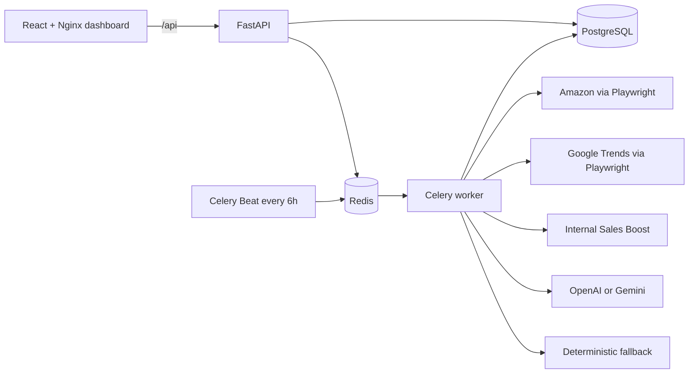

# Lemon Brothers Product Intelligence

An authenticated MVP for discovering and ranking potentially trending e-commerce products. It collects Amazon Best Sellers with Playwright, observes Google Trends browser traffic, applies an Internal Sales Boost from previous winners, and stores an explainable 0–100 score from a configured LLM or a deterministic zero-key fallback.

## Architecture



The application is a modular monolith. FastAPI owns authentication and the HTTP contract; it never performs scraping or scoring inside a request. Celery runs Amazon collection, Google Trends collection, boost calculation, and scoring. Celery Beat enqueues the complete Amazon → Trends → Score pipeline at `0 */6 * * *`.

## Main components

- **FastAPI API** — JWT login, product results, async task status, Amazon/Trends triggers, and Sales Boost management.
- **PostgreSQL** — users, idempotently upserted products, trend snapshots, and historical successful products.
- **Redis + Celery** — broker, result backend, worker, and six-hour Beat schedule.
- **Amazon scraper** — Chromium navigation through Playwright with a separately tested defensive HTML parser; the default source is the Home & Kitchen Best Sellers category so persisted categories remain meaningful.
- **Google Trends collector** — Playwright browser navigation and capture of the timeline response generated by the page. Keywords are collected in comparison batches of at most five, with bounded retry/backoff and a circuit breaker for repeated HTTP 429 responses.
- **Scoring engine** — category/keyword boost plus validated structured OpenAI or Gemini output, with deterministic fallback on missing key, timeout, invalid response, or provider failure.
- **React dashboard** — protected routes, product table, async controls, task polling, manual history entry, and CSV import.

## Quick start

From a clean clone, run one command:

```bash
docker-compose up --build
```

Modern Docker Compose also accepts:

```bash
docker compose up --build
```

No `.env`, migration command, seed command, Playwright install, or user-creation step is required. Compose waits for PostgreSQL and Redis, runs Alembic and the idempotent seed in a one-shot container, then starts the API, worker, Beat, and frontend.

## URLs and login

- Dashboard: <http://localhost:3000>
- API: <http://localhost:8000>
- OpenAPI docs: <http://localhost:8000/docs>
- Health check: <http://localhost:8000/api/health>

Test account:

```text
Username: admin
Password: admin123
```

## Environment configuration

[`.env.example`](.env.example) documents all supported settings and safe development defaults. The application starts and scores successfully without any AI key. Real credentials belong only in an ignored local `.env`; never add them to `.env.example`, Compose, source, tests, or documentation.

LLM selection rules:

```text
LLM_PROVIDER=openai + OPENAI_API_KEY present  -> OpenAI
LLM_PROVIDER=gemini + GEMINI_API_KEY present  -> Gemini
missing key, unsupported provider, or provider failure -> deterministic fallback
```

`LLM_MODEL=gpt-5-mini` is the default OpenAI model. When Gemini is selected while that OpenAI model name remains configured, the adapter selects the current Gemini Flash default. Provider responses must satisfy the JSON schema `{score: 0..100, reasoning: string}` before they can be persisted.

The committed Compose file deliberately contains no LLM secret variables and exercises the secure zero-key fallback path. Compose may read the root `.env` for safe substitutions, but it does not inject any provider key into an image or container. To verify cloud providers against a local ignored `.env`:

```bash
cd backend
python -m scripts.verify_llm_providers
```

The script reports only PASS/FAIL and never prints model responses or keys.

## Deterministic fallback

The fallback is pure, transparent, and repeatable:

| Signal | Maximum |
|---|---:|
| Google Trends recent average | 40 |
| Product rating normalized from 0–5 | 25 |
| Review confidence using `log10(1 + reviews)` | 15 |
| Internal Sales Boost | 20 |
| **Total** | **100** |

Every component is clamped to its range. The resulting `score` is clamped to 0–100, and `reasoning` states the contribution of each signal.

## Internal Sales Boost

Historical products are normalized case-insensitively. An exact normalized category match contributes 10 points. The best keyword-overlap coefficient contributes up to 10 more, with a hard maximum of 20.

The dashboard accepts manual entries and UTF-8 CSV files up to 2 MB / 5,000 rows. CSV columns:

```csv
title,category,keywords
Wireless Neck Fan,Home & Kitchen,"neck fan,cooling,portable fan"
```

See [`examples/sales_boost.csv`](examples/sales_boost.csv).

## API workflow

After login, heavy endpoints respond with `202 Accepted` and a Celery task ID:

```text
POST /api/scraping/amazon
POST /api/trends/collect
GET  /api/tasks/{task_id}
```

Product collection uses ASIN when available, otherwise a canonical product URL, so repeated runs update existing records instead of creating duplicates.

## Testing

Backend:

```bash
cd backend
pytest
```

Frontend:

```bash
cd frontend
pnpm install --frozen-lockfile
pnpm run typecheck
pnpm run build
```

Live provider verification (requires keys only in the ignored root `.env`):

```bash
cd backend
python -m scripts.verify_llm_providers
```

Clean container acceptance:

```bash
docker compose down -v
docker compose build --no-cache
docker compose up -d
docker compose ps
```

## Manual verification

1. Open <http://localhost:3000> and sign in with the test account.
2. Select **Run Amazon collection**. The UI shows the accepted task instead of claiming synchronous completion.
3. Wait for success and refresh. Confirm title, category, price, rating, review count, product link, and image.
4. Select **Run trend collection** and observe its Celery task status and result counters. On a blocked IP the task must finish and show `No fresh trend data` plus collected/failed/rate-limited counts instead of leaving the page waiting.
5. Open **Sales Boost**, add one successful product, then return to the dashboard and inspect changed boost/score/reasoning.
6. Upload `examples/sales_boost.csv`; confirm created/duplicate/invalid counts.
7. Remove all LLM keys from the process environment and run rescoring. Product rows should show `score_source=fallback`, a 0–100 score, and deterministic reasoning.

## Known limitations

- Amazon and Google Trends DOM/network behavior is not a stable public contract and can change without notice.
- Either site may present CAPTCHA, consent, regional markup, or automation rate limiting. The collectors do not bypass these controls; they fail clearly while fixture/parser tests continue to validate internal logic.
- Google Trends returned HTTP 429 for the current verification IP. A clean 20-product run finished in about 10 seconds after two bounded browser attempts and reported `0 collected / 20 failed / 20 rate-limited`; it did not hang or fabricate values. Retry after the provider's IP cooldown to obtain fresh snapshots.
- Keyword extraction is intentionally deterministic and lightweight for the four-day MVP; it does not perform language detection or semantic entity extraction.
- The development login and JWT default are for local evaluation only and must be replaced in a real deployment.
